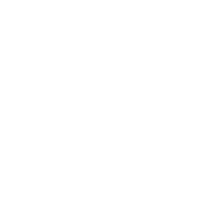
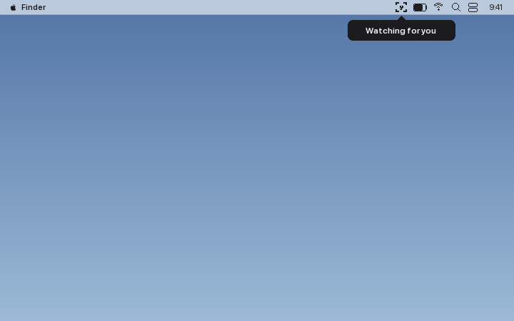

<div align="center">
  <picture>
    
  </picture>
</div>

<h1 align="center">Lockscreen Dah?</h1>

<p align="center">
  <a href="LICENSE"></a>
  
  
  <a href="https://github.com/jvloo/lockscreen-dah-macos/releases"></a>
</p>

macOS menu-bar app that watches the webcam for **your** face and auto-locks the
screen when you step away. When your face stops being detected (or someone
else's face is there instead of yours), the countdown overlay takes over:
every screen goes blank black with a small, faded countdown in the bottom-right
corner. Face the screen again to cancel, or let it expire to lock the Mac.

<p align="center">
  
  <br>
  <em>Illustrative mockup of the menu bar → countdown → lock sequence.</em>
</p>

## Features

- **On-device face recognition**: Vision + Core ML (InsightFace MobileFaceNet,
  landmark-aligned); nothing camera-derived ever leaves the machine.
- **Seat-continuity presence**: a face at any angle, an upper body in frame,
  or live keyboard/mouse input all keep your session open. Only losing all
  three for the grace period triggers a countdown.
- **Camera rests while you type**, waking (and re-verifying identity) on the
  next pause, for near-zero CPU during typing-heavy stretches.
- **Discreet blackout countdown**: reads as a sleeping display, not a
  "you're being watched" banner. A face match or Esc cancels it.
- **Guided enrollment**: three staged poses, automatic live verification,
  nothing saved until you confirm.
- **Active Hours schedule**: auto-starts/pauses on a schedule; manual
  overrides survive sleep, lock, and multi-day gaps correctly.
- **Failsafes**: Esc-rescue auto-pause, post-lock verification (never sits
  in a fake "locked" state), auth-gated re-enrollment.

## Contents

- [Requirements](#requirements)
- [Build](#build)
- [Menu](#menu)
- [Settings](#settings)
- [How it works](#how-it-works)
- [Security](#security)
- [Appearance changes](#appearance-changes-glasses-occlusion-makeup)
- [Acknowledgments](#acknowledgments)
- [Contributing](#contributing)
- [Changelog](#changelog)
- [License](#license)

## Requirements

- macOS 13 (Ventura) or later: the app targets `.macOS(.v13)` (`Package.swift`).
- Xcode Command Line Tools, for `swift build` and `codesign` (used by `build.sh`).
- Internet access for the one-time model download (`scripts/fetch-model.sh`).
- A Mac with a camera.

## Build

```sh
scripts/fetch-model.sh   # one-time: download ONNX + convert to Core ML (needs internet + Xcode CLT)
./build.sh               # swift build -c release, bundle to build/Lockscreen Dah.app, ad-hoc codesign
./build.sh --install     # also (re)install to /Applications/Lockscreen Dah.app and launch
```

The SPM target/binary is `LockscreenDah`; the on-disk app bundle and
`Info.plist` name is **Lockscreen Dah** (no question mark). Only in-app UI
(menu titles, window titles, About panel) uses **Lockscreen Dah?**. Rebuilding
re-signs the app, so macOS may re-prompt for camera permission once.

First launch asks for camera permission. Menu bar → the red **No Face
Enrolled** item (or **Re-Enroll My Face** afterward) to enable owner
recognition.

Prefer a prebuilt download over building from source? Grab the zip from
[Releases](https://github.com/jvloo/lockscreen-dah-macos/releases). It's
ad-hoc signed, not notarized (no paid Apple Developer ID behind this
project), so macOS blocks the first launch with *"can't be opened because
Apple cannot check it for malicious software."* To open it anyway:

1. Double-click it once (expected to fail: that's the block).
2. **System Settings → Privacy & Security** → scroll to the bottom → click
   **Open Anyway** next to the mention of Lockscreen Dah, and authenticate.
3. Open it again: a second, milder dialog offers **Open**; click it.

Only needed once per download (a rebuild changes the signature and resets
this). `xattr -cr` alone does **not** work on current macOS: it clears the
quarantine flag but not the separate `com.apple.provenance` attribute
Gatekeeper also checks. Prefer Terminal instead? `sudo spctl --add
"/Applications/Lockscreen Dah.app"` (prompts for your password).

## Menu

Status line + menu-bar icon per state:

| State | Icon | Status line |
|---|---|---|
| Paused | pause.circle | "Paused" / "Paused (off hours)" |
| Watching (enrolled) | faceid | "Watching for you" |
| Watching (no profile) | ⚠️ exclamationmark.triangle.fill | "Watching for any face" |
| Camera idle (typing) | 💤 moon.zzz.fill | "Idle while typing" |
| Countdown / Locked | unchanged from watching | unchanged from watching (the overlay / lock screen is what you see) |
| Enrolling | person.crop.circle.badge.plus | "Enrolling face…" |

Items:

- **▶ Start / ⏸ Pause Monitoring**
- **Re-Enroll My Face** (redo icon; Touch ID / password required): reads
  **No Face Enrolled** (red, warning icon) until a profile exists, or the
  disabled **Face model missing (run scripts/fetch-model.sh)** if
  `FaceEmbedding.mlmodelc` wasn't bundled
- **Settings ▸** Start Countdown After / Countdown Duration / Idle When
  Typing For / Wake From Idle After / Active Hours… / Open at Login:
  option rows apply immediately and keep the menu open; chosen value shows
  in each item's title (see [Settings](#settings))
- **About Lockscreen Dah?**: intro, author, version, and an update check
  (Check for Update → Download Update once a newer release is found;
  reports gracefully until the first release tag exists)
- **Quit Lockscreen Dah?**

## Settings

Every setting, what it trades off, and which way to turn it.

### Start Countdown After (1/3/5/10/15/30 s, default 3)

How long presence can lapse before the blackout countdown appears.

- **Lower** = faster reaction when you leave, but more false blackouts
  (glancing at your phone under the desk), and **higher CPU**: the analysis
  cadence is `grace/3` (clamped 0.4–2.5 s), so grace 1 samples at the maximum
  0.4 s rate permanently. At 1 s, camera idling is also disabled (wake +
  spin-up + match can't fit inside the grace).
- **Higher** = cheaper (grace 30 analyzes every 2.5 s) and calmer, but a
  stranger inherits a bigger head start: the countdown starts up to `grace`
  seconds after you're gone.

### Countdown Duration (1/3/5/10/15/30 s, default 3)

Length of the blackout countdown before the lock fires.

- **Lower** = the screen locks sooner after a confirmed absence; also less
  time for *you* to cancel a false alarm with a glance.
- **Higher** = more forgiving of false alarms, but extends the total
  exposure window (grace + countdown) before a real lock. A stranger can't
  cancel it either way: only your face or Esc can.

### Idle When Typing For (5/10/15/30 s / Never Idle, default 10)

Sustained keyboard/mouse use required before the camera goes to sleep
(input alone proves presence once your identity is established).

- **Lower** = the camera sleeps sooner → more time at ~0% CPU, but more
  rest/wake cycling (each wake costs a brief session-restart spike).
- **Higher** = camera watches longer before sleeping; fewer cycles.
- **Never Idle** = the camera always watches (steady ~8–9% CPU) and the
  wake option below is disabled. Maximum vigilance: no blind window at all;
  choose this in hostile environments.

### Wake From Idle After (1/2/3/5/10 s, default 2)

The typing pause that wakes an idle camera.

- **Lower** = tighter security (the camera's blind window ends at every
  micro-pause) but the camera wakes constantly during natural typing, so
  the idle feature saves little.
- **Higher** = the camera sleeps through natural pauses (real savings), but
  **two costs**: departure detection starts up to this long after your last
  keystroke, and a stranger who took over mid-idle stays invisible until
  they pause typing this long. Every wake is an identity gate (only a fresh
  match restores presence), so post-pause lockout is
  ~wake + grace + countdown regardless of this value.

### Active Hours (default 9:00 AM–8:00 PM, or "Always on")

Panel with an "Always on" checkbox and hour:minute pickers; edits apply on
**Save**, **Cancel** discards. Auto-starts monitoring at the start boundary,
auto-pauses at the end ("Paused (off hours)"). Boundary crossings force the
state; in between, manual Start/Pause wins: pausing at 10:00 stays paused
until tomorrow 09:00, manually starting at 22:00 runs until the next end
boundary. Overnight ranges (e.g. 21:00–06:00) work. A boundary never unlocks
a locked screen. **Off hours = zero resource use and zero protection**: the
schedule is a convenience, not a security feature.

### Open at Login (default on)

Registers via `SMAppService` on first run; the checkmark reflects the actual
system registration state, not a stored preference.

### Hidden: match threshold (default 0.35)

```sh
defaults write com.xavierloo.lockscreen-dah matchThreshold -float 0.3
```

(The `-float` matters: a bare number is stored as a string and ignored.)
Cosine similarity for "this face is me". **Lower** = fewer false countdowns
in bad lighting / unusual looks, but easier for a look-alike to pass.
**Higher** = stricter identity, more false countdowns. Landmark-aligned
matches typically score 0.6+; the lenient default leaves room for the
unaligned fallback used when landmarks fail (strong profile views). Clamped
at read time to **[0.2, 0.9]** so a stray value can't turn matching into
"everyone passes" or "no one ever does".

## How it works

```
AVCaptureSession (640x480 YUV, sensor capped ~3 fps)
  → adaptive throttle (idle scales with grace period: one analysis per grace/3 s,
    clamped 0.4–2.5 s; ~2.5 Hz only while confirming absence / countdown)
  → Vision face detection (any head angle); upper-body detection only on face-less frames
  → [face found] align → Core ML MobileFaceNet embedding (ANE) → cosine match vs enrolled profile
  → presence chain (face | body | input) + state machine → blackout countdown overlay → SACLockScreenImmediate
```

- **Owner recognition**: a bundled MobileFaceNet model (InsightFace `w600k_mbf`,
  converted to Core ML) produces a 512-d identity embedding per face, matched
  by cosine similarity against your enrolled profile. Faces are **aligned
  first**: Vision landmarks put the pupils on canonical positions before
  embedding, which is what makes matching robust across head tilt, eye angle,
  and distance (a plain bounding-box crop is the fallback when landmarks fail).
- **Enrollment** opens a guided window: three staged poses (straight ahead,
  turn left, turn right), then an automatic live verification test against
  the candidate profile. Nothing is saved until you confirm, and your
  existing profile is never touched until then. Enrolling/re-enrolling
  requires Touch ID or your macOS password, so a passerby can't swap it.
  Profile lives at `~/Library/Application Support/LockscreenDah/profile.json`.
- **Presence chain**: identity is *established* by a frontal match, then
  *maintained* with no time cap by seat continuity: a face at any angle, an
  upper body in frame, or live keyboard/mouse input. Work turned toward a
  second screen for an hour; the countdown never appears while you're in the
  seat or typing. A clearly frontal face that strongly mismatches you for 3
  consecutive frames breaks the chain even if they keep the seat warm.
- **The countdown is the identity gate**: once presence lapses past the
  grace period, only a fresh positive match (or Esc) cancels it; an
  unmatched face alone can't keep the screen open. The overlay is
  deliberately discreet, a passerby sees a sleeping display, not a "this Mac
  is unlocked" billboard; you get a soft chime as the cue.
- **Camera idle while typing**: sustained keyboard/mouse use puts the
  capture session to sleep entirely (LED off, ~0% CPU); it wakes once
  typing pauses. Waking is an identity gate: the camera was blind, so the
  chain must be re-established by a fresh match before input/body can
  maintain it again. Never idles before a positive match, during
  countdown/enrollment, or when the grace period is under 3 s.
- **Lock is verified, not assumed**: a few seconds after firing the lock,
  the app confirms the session actually locked. A silent failure (e.g. the
  private API disappearing in an OS update) pauses monitoring and alerts
  you, instead of sitting in a fake "locked" state.
- **Unenrolled fallback**: without a profile (or model) it degrades to
  presence-only: any face counts.
- **Low footprint**: sensor frame rate capped, analysis throttled, the
  embedding model only runs when a face is detected, and the camera fully
  stops while locked/asleep/paused. Measured while watching: ~150 MB RSS,
  ~8–9% of one core. Idle / paused / locked: ~16 MB, 0% CPU.

## Security

### Model

What the app is and isn't, so the guarantees are clear:

- **It's a presence/discipline tool, not authentication.** It decides
  *should the screen stay unlocked* from a webcam view; the lock it triggers
  is the real macOS lock, and getting back in always needs your
  password/Touch ID.
- **Identity is established, then maintained**, without a time cap, by the
  seat-continuity chain described in [How it works](#how-it-works): this is
  what lets you work turned toward a second screen without nagging.
- **Two identity gates re-assert "is it really you"**: the countdown (a
  stranger's face alone can't hold the screen open) and waking from camera
  idle (input/body alone won't restore presence; only a fresh match will).
- **Fail-closed.** Camera contention, a stuck pipeline, or a lost face all
  let absence grow into a lock rather than a false sense of safety.
- **All processing is on-device**. See [Audit findings](#audit-findings)
  for the traced, frame-by-frame claim.

### Risks

Worst-case time until the screen locks, with defaults (grace 3 s,
countdown 3 s, wake 2 s):

| Scenario | Max exposure |
|---|---|
| You leave; empty seat | ~6 s (grace + countdown) |
| Stranger takes the seat and faces the screen | ~9 s (3-frame challenge + grace + countdown) |
| Stranger takes over during camera idle, then pauses typing ≥ wake threshold | ~8 s after the pause (wake gate: only a match restores presence) |
| Stranger takes over during camera idle and **never pauses input** past the wake threshold | **Unbounded** (the camera never wakes). Mitigate: lower Wake From Idle After, or Never Idle. |
| Stranger in the seat who **never faces the screen** (head down, turned away) while the camera watches | **Unbounded**: seat continuity counts any face/body, and the stranger challenge only accuses frontal faces. In practice people glance at screens constantly; the challenge fires at their first 3 frontal frames. |

Structural risks, independent of settings:

- **Photo/video spoof**: webcam RGB matching has no liveness detection: a
  photo of you can cancel a countdown or re-establish presence. This is
  presence/discipline tooling, not authentication; unlocking still requires
  your password/Touch ID.
- **Esc cancels the countdown** and is not identity-checked (it's the
  failsafe against a bad enrollment locking you out). Anyone who knows it
  can cancel countdowns, but 3 Esc-rescues in 10 minutes auto-pauses
  monitoring *visibly* (alert + pause icon), so it can't be exploited
  silently forever.
- **Presence-only fallback**: with no enrolled profile, *any* face counts
  as you. The warning icon and red menu item exist precisely because this
  mode offers no identity protection; enroll immediately.
- **Off hours / paused = unprotected** by design; check the menu-bar icon.
- **Private API dependency**: `SACLockScreenImmediate` (login.framework,
  same private API as Ctrl-Cmd-Q) could disappear in a macOS update;
  `CGSession -suspend` is the fallback, and either way the post-lock
  verification above catches a silent failure rather than hiding it.
- **Camera contention**: another app owning the camera can stall detection;
  absence then grows until the countdown fires and locks (fail-closed, but
  expect a surprise blackout).
- Physical access to your unlocked Mac is, as always, game over for any
  software measure.

### Audit findings

Because the app holds the webcam open continuously, it was audited
specifically for whether *any* party (remote attacker, local malware, a
compromised dependency, or the app itself) could use it to get camera
frames (or the derived face embeddings) off the machine.

**Data handling is clean.** Frames exist only as in-memory `CVPixelBuffer`s
that reach only Vision and the on-device Core ML model; no frame, crop, or
embedding is ever written to disk, put on the pasteboard, or sent to
another process. The only network call in the whole app is the **opt-in**
"Check for Update" GET to the GitHub releases API; it carries nothing
camera-derived.

| # | Severity | Issue | Fix |
|---|---|---|---|
| 1 | **Critical** | Ad-hoc signed with **Hardened Runtime off** → local malware could inject a dylib into this always-camera-on process and read frames under the app's TCC grant | **Fixed**: `codesign --options runtime` + camera entitlement; the loader now ignores `DYLD_INSERT_LIBRARIES` and enforces library validation |
| 2 | Medium | Synthetic input (`CGEventPost`) could fake presence and hold the screen open | **Fixed**: switched to `.hidSystemState`, which counts only physical HID input |
| 3 | Medium | A forged `com.apple.screenIsUnlocked` notification could make the app start the camera | **Fixed**: the resume path confirms the session is genuinely unlocked and re-checks the schedule before starting |
| 4 | Medium | `profile.json` (face embeddings) written world-readable | **Fixed**: written `0600` (owner-only) |
| 5 | Medium | Model download had no integrity check | **Fixed**: `fetch-model.sh` pins the InsightFace zip's SHA-256 |
| 6 | Info | Tampered `matchThreshold` in defaults could disable matching | **Fixed**: clamped to [0.2, 0.9] at read time |

**Residual risks (accepted, not code-fixable)** all require an attacker who
*already has code execution as your user*, at which point the machine is
compromised regardless of this app: same-user code can overwrite
`profile.json` with different embeddings (a Keychain-HMAC would raise this
bar; not implemented), or `SIGSTOP`/kill the app, or spam a forged lock
notification to stop it watching. An unprivileged menu-bar app can't defend
against same-user code without a privileged helper.

**Verdict**: the app's own logic creates no channel for camera data to
leave the machine. The one packaging weakness that *did* create a real
frame-exfiltration path for local malware, the missing Hardened Runtime, is
now closed. For distribution beyond your own machine, the recommended next
step is a Developer ID signature + notarization (the ad-hoc signature is
fine for local use and already carries Hardened Runtime).

## Appearance changes (glasses, occlusion, makeup)

- **Glasses on/off**: mostly fine; regular clear glasses drop similarity a
  little but typically stay above the lenient 0.35 threshold. **Sunglasses**
  hide the eye region and hurt a lot.
- **Hand half-covering the face**: recognition usually fails but Vision still
  detects a face/body, so the presence chain keeps you present. Sitting down
  *already* covered (no chain established) just shows a countdown until you
  uncover.
- **Makeup**: everyday makeup is negligible (embeddings key on geometry, not
  surface color); heavy contouring/theatrical makeup can push below threshold.

Mitigations: enroll in your usual look; if you alternate looks (e.g.
glasses/no glasses), switch mid-enrollment so the samples cover both. If a
look keeps triggering false countdowns, lower `matchThreshold` (each false
countdown is visible and cancellable with a glance, so tuning down is
low-risk).

## Acknowledgments

Face recognition uses [InsightFace](https://github.com/deepinsight/insightface)'s
`w600k_mbf` (MobileFaceNet) recognition model from the `buffalo_sc` pack,
fetched and converted to Core ML by `scripts/fetch-model.sh`; it is never
bundled or redistributed in this repo. **InsightFace's own code is
MIT-licensed, but its pretrained models (including this one) are released
for non-commercial research purposes only.** See their
[model zoo license](https://github.com/deepinsight/insightface/blob/master/model_zoo/README.md)
and [commercial licensing page](https://www.insightface.ai/solutions/face-recognition-licensing).
Commercial use of Lockscreen Dah? (distinct from personal/non-commercial use)
may require separately licensing the model from InsightFace; this project's
own [MIT License](LICENSE) covers only its own Swift source.

## Contributing

Bug reports and focused PRs are welcome; see [CONTRIBUTING.md](CONTRIBUTING.md)
for the development setup, testing approach, and code style.

## Changelog

See [CHANGELOG.md](CHANGELOG.md).

## License

[MIT](LICENSE). See [Acknowledgments](#acknowledgments) above for the
separate terms covering the bundled face-recognition model.
