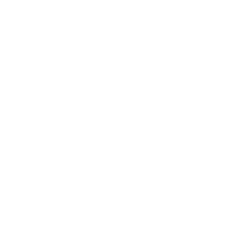
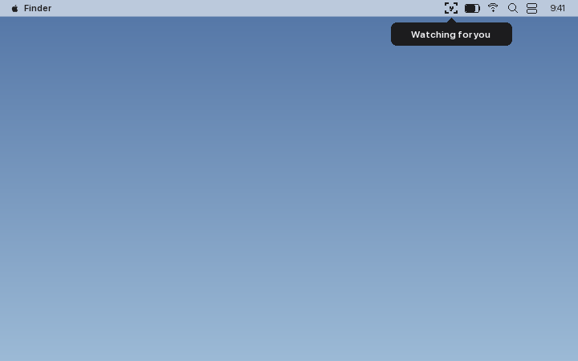

<h1 align="center">
  <br>
  Lockscreen Dah? (macOS)
</h1>

<p align="center">
  <a href="LICENSE"></a>
  
  
  <a href="https://github.com/jvloo/lockscreen-dah-macos/releases"></a>
</p>

<p align="center">
  Using Windows? <a href="https://github.com/jvloo/lockscreen-dah-windows">Check out here</a>
</p>

macOS menu-bar app that watches the webcam for **your** face and auto-locks the
screen when you step away. When your face stops being detected (or someone
else's face is there instead of yours), the countdown overlay takes over:
every screen goes blank black with a small, faded countdown in the bottom-right
corner. Face the screen again to cancel, or let it expire to lock the Mac.

<p align="center">
  
  <br>
  <em>Illustrative mockup of the menu bar → countdown → lock sequence.</em>
</p>

## Features

- **On-device face recognition**: Vision + Core ML (InsightFace MobileFaceNet,
  landmark-aligned); nothing camera-derived ever leaves the machine.
- **Seat-continuity presence**: a face at any angle or an upper body in frame
  keeps your session open. Losing both for the grace period triggers a
  countdown — and a face already confirmed as not you never counts toward
  it, so simply sitting in your seat buys a stranger no extra time.
- **The camera is never switched off while monitoring.** There is no
  idle-while-typing mode: it substituted keystrokes for a verified face for a
  duration an intruder could extend at will, which is the one thing this app
  exists to prevent.
- **Discreet blackout countdown**: reads as a sleeping display, not a
  "you're being watched" banner. A face match cancels it; there is no
  unauthenticated way to dismiss it.
- **Guided enrollment**: four staged poses, automatic live verification,
  nothing saved until you confirm.
- **Active Hours & Days**: auto-starts/pauses on an hour range and a weekday
  selection (default Mon–Fri); manual overrides survive sleep, lock, and
  multi-day gaps correctly.
- **Failsafes**: an authenticated Esc escape for when recognition fails you,
  a lock-loop fallback that can't strand you, post-lock verification (never
  sits in a fake "locked" state), auth-gated re-enrollment.

## Contents

- [Requirements](#requirements)
- [Build](#build)
- [Menu](#menu)
- [Settings](#settings)
- [How it works](#how-it-works)
- [Security](#security)
- [Appearance changes](#appearance-changes-glasses-occlusion-makeup)
- [Acknowledgments](#acknowledgments)
- [Contributing](#contributing)
- [Changelog](#changelog)
- [License](#license)

## Requirements

- macOS 13 (Ventura) or later: the app targets `.macOS(.v13)` (`Package.swift`).
- Xcode Command Line Tools, for `swift build` and `codesign` (used by `build.sh`).
- Internet access for the one-time model download (`scripts/fetch-model.sh`).
- A Mac with a camera.

## Build

```sh
scripts/fetch-model.sh   # one-time: download ONNX + convert to Core ML (needs internet + Xcode CLT)
./build.sh               # swift build -c release, bundle to build/Lockscreen Dah.app, ad-hoc codesign
./build.sh --install     # also (re)install to /Applications/Lockscreen Dah.app and launch
```

The SPM target/binary is `LockscreenDah`; the on-disk app bundle and
`Info.plist` name is **Lockscreen Dah** (no question mark). Only in-app UI
(menu titles, window titles, About panel) uses **Lockscreen Dah?**. Rebuilding
re-signs the app, so macOS may re-prompt for camera permission once.

First launch asks for camera permission. Menu bar → the red **No Face
Enrolled** item (or **Re-Enroll My Face** afterward) to enable owner
recognition.

Prefer a prebuilt download over building from source? Grab the zip from
[Releases](https://github.com/jvloo/lockscreen-dah-macos/releases). It's
ad-hoc signed, not notarized (no paid Apple Developer ID behind this
project), so macOS blocks the first launch with *"can't be opened because
Apple cannot check it for malicious software."* To open it anyway:

1. Double-click it once (expected to fail: that's the block).
2. **System Settings → Privacy & Security** → scroll to the bottom → click
   **Open Anyway** next to the mention of Lockscreen Dah, and authenticate.
3. Open it again: a second, milder dialog offers **Open**; click it.

Only needed once per download (a rebuild changes the signature and resets
this). `xattr -cr` alone does **not** work on current macOS: it clears the
quarantine flag but not the separate `com.apple.provenance` attribute
Gatekeeper also checks. Prefer Terminal instead? `sudo spctl --add
"/Applications/Lockscreen Dah.app"` (prompts for your password).

## Menu

Status line + menu-bar icon per state:

| State | Icon | Status line |
|---|---|---|
| Paused | pause.circle | "Paused" / "Paused (off hours)" / "Paused (Sat not active)" |
| Watching (enrolled) | faceid | "Watching for you" |
| Watching (no profile) | ⚠️ exclamationmark.triangle.fill | "Watching for any face" |
| Countdown / Locked | unchanged from watching | unchanged from watching (the overlay / lock screen is what you see) |
| Enrolling | person.crop.circle.badge.plus | "Enrolling face…" |

Items:

- **▶ Start / ⏸ Pause Monitoring**
- **Re-Enroll My Face** (redo icon; Touch ID / password required): reads
  **No Face Enrolled** (red, warning icon) until a profile exists, or the
  disabled **Face model missing (run scripts/fetch-model.sh)** if
  `FaceEmbedding.mlmodelc` wasn't bundled
- **Settings ▸** Start Countdown After / Countdown Duration /
  Active Hours & Days… / Open at Login:
  option rows apply immediately and keep the menu open; chosen value shows
  in each item's title (see [Settings](#settings))
- **About Lockscreen Dah?**: intro, author, version, and an update check
  (Check for Update → Download Update once a newer release is found;
  reports gracefully until the first release tag exists)
- **Quit Lockscreen Dah?**

## Settings

Every setting, what it trades off, and which way to turn it.

### Start Countdown After (1/3/5/10 s, default 1)

How long presence can lapse before the blackout countdown appears.

- **Lower** = faster reaction when you leave, at **higher CPU**: the analysis
  cadence is `delay/4`, floored at 0.25 s and capped at 2.5 s. Note this scaling
  means roughly four detection attempts fit inside the window at *any* setting,
  so a lower value is not more prone to false blackouts — it costs CPU and
  shortens the time you have to be re-recognised, nothing else.
- **Higher** = cheaper (10 s analyzes every ~2.5 s) and calmer, but a stranger
  inherits a bigger head start.

**How exact is it?** The countdown fires within a few milliseconds of the
configured delay after presence was last *confirmed*. But presence is sampled,
not watched continuously, so the last confirmation is up to one sampling
interval before you actually stood up, and measured from *that* moment the
countdown lands **early** by up to that interval:

| Setting | Effective sampling | Countdown appears after you actually leave |
|---|---|---|
| 1 s | ~0.27 s | 0.73–1.0 s |
| 3 s | ~0.77 s | 2.2–3.0 s |
| 5 s | ~1.27 s | 3.7–5.0 s |
| 10 s | ~2.5 s | 7.5–10.0 s |

It never lands late. Closing the gap further means sampling faster, which is
the CPU tradeoff above. (An earlier version of this table assumed the sensor
ran at 3 fps, which the code asks for but this hardware does not honour —
measured delivery is far higher, so the quantisation is finer than previously
documented.) The clock also doesn't start until the camera has
delivered its first frame, so opening a session never eats into your delay.

### Countdown Duration (3/5/10 s or Never Countdown, default 3)

Length of the blackout countdown before the lock fires.

- **Lower** = the screen locks sooner after a confirmed absence; also less
  time for *you* to cancel a false alarm with a glance. 3 s is the floor
  because cancelling takes about a second in practice (overlay fade, you
  noticing, the next analyzed frame, the embedding) — a shorter countdown
  would be a lock with no real appeal, not a warning.
- **Higher** = more forgiving of false alarms, but extends the total exposure
  window (delay + countdown) before a real lock. A stranger can't cancel it
  either way: only your face, or Esc ×3 followed by Touch ID.
- **Never Countdown** = no countdown and no overlay at all; the screen locks the
  moment presence lapses. Strictest setting. With no overlay there is also no Esc
  gesture, so if recognition starts misjudging you it would lock you out
  repeatedly — a single lock is harmless, but a loop is a trap. A fallback covers
  that: after two locks with no successful match in between, a minimum 3 s
  countdown is restored regardless of this setting, purely so the escape gesture
  exists again. Any real match clears it and instant locking resumes.

### Active Hours & Days (default 9:00 AM–8:00 PM, Mon–Fri)

Monitoring around the clock is what **"Always on"** is for; equal start and end
times are rejected rather than silently meaning 24 hours.

One panel (menu bar → Settings → Active Hours…) with an "Always on" checkbox,
hour:minute pickers, weekday checkboxes and an "All days" toggle. Edits apply on
**Save**; **Cancel** discards. Monitoring auto-starts at the start boundary and
auto-pauses at the end, and the status line says which reason applies —
"Paused (off hours)" or "Paused (Sat not active)".

Hours and days are one model rather than two filters: each selected weekday opens
a single window at the start time, lasting the configured span. So overnight
ranges work (21:00–06:00), and such a window belongs to the day it **opened** on
— a Friday 21:00–06:00 shift stays active into Saturday morning even when
Saturday isn't selected, which is what an overnight range means.

At least one day must stay selected; an empty set would mean monitoring never
runs, which reads as configured protection but provides none. Boundary crossings
force the state, and in between manual Start/Pause wins: pausing at 10:00 stays
paused until the next boundary, manually starting at 22:00 runs until the next
end boundary. A boundary never unlocks a locked screen. **Off hours, or an
inactive day, means zero resource use and zero protection** — the schedule is a
convenience, not a security feature.

### Open at Login (default on)

Registers via `SMAppService`; the checkmark reflects the actual system
registration state, not a stored preference. Your choice is also saved
separately and reconciled against the real registration on every launch (not
just the first), clearing out any stale entry before re-registering — a
rebuild re-signs the app, and macOS's login-item registration doesn't
reliably survive that on its own.

### Hidden: match threshold (default 0.45)

```sh
defaults write com.xavierloo.lockscreen-dah matchThreshold -float 0.3
```

(The `-float` matters: a bare number is stored as a string and ignored.)
Cosine similarity for "this face is me". **Lower** = fewer false countdowns
in bad lighting / unusual looks, but easier for a look-alike to pass.
**Higher** = stricter identity, more false countdowns. With all four poses
enrolled, a held-out live frame scores ~0.96 and the weakest enrolled pose
~0.71, which is what the 0.45 default is set against — measured, not assumed.
The floor is head-down: it scores lowest *and* is held longest while typing, so
it is the pose that decides how far this can be tightened. Clamped at read time
to **[0.2, 0.9]** so a stray value can't turn matching into "everyone passes"
or "no one ever does".

## How it works

```
AVCaptureSession (640x480 YUV; the sensor is asked for its slowest rate,
  which some cameras ignore — the analysis throttle is what bounds cost)
  → adaptive throttle (idle scales with the countdown delay: one analysis per
    delay/4 s, clamped 0.25–2.5 s; every frame while confirming absence / counting down)
  → Vision face detection (any head angle); upper-body detection only on face-less frames
  → [face found] align → Core ML MobileFaceNet embedding (ANE) → cosine match vs enrolled profile
  → presence chain (face | body) + state machine → blackout countdown overlay → SACLockScreenImmediate
```

- **Owner recognition**: a bundled MobileFaceNet model (InsightFace `w600k_mbf`,
  converted to Core ML) produces a 512-d identity embedding per face, matched
  by cosine similarity against your enrolled profile. Faces are **aligned
  first**: Vision landmarks put the pupils on canonical positions before
  embedding, which is what makes matching robust across head tilt, eye angle,
  and distance (a plain bounding-box crop is the fallback when landmarks fail).
- **Enrollment** opens a guided window: four staged poses (straight ahead, turn
  one way, turn the other, then look down at the keyboard), then an automatic
  live verification test against the candidate profile. Each stage checks that
  the frame actually shows the pose asked for and says what to correct — without
  that, a user who barely moves produces samples that all land in one bucket, no
  pose template forms, and enrollment "passes" while covering nothing. Which
  physical direction each turn goes is never assumed: the preview is mirrored
  while Vision measures the unmirrored buffer, so the stages require two
  *opposite* turns and let the user's first turn define the pair. Head tilt is
  judged against the resting pitch captured in the first stage, since a laptop
  camera reads ~0.2 rad on someone sitting normally. Nothing is saved until you confirm, and your
  existing profile is never touched until then. Enrolling/re-enrolling
  requires Touch ID or your macOS password, so a passerby can't swap it.
  Profile lives at `~/Library/Application Support/LockscreenDah/profile.json`.
- **Three answers, not two**: a frontal face is scored as *confidently you*
  (refreshes identity), *confidently not you* (breaks the chain after three
  consecutive frames), or *ambiguous* — and ambiguity sustains presence exactly
  as a turned head does. Treating "don't know" as "not you" made the owner's own
  marginal frames stop the presence clock.
- **Presence chain**: identity is *established* by a frontal match, then
  *maintained* with no time cap by seat continuity: a face at any angle, or
  an upper body in frame. Work turned toward a second screen for an hour;
  the countdown never appears while you're in the seat. A face already
  confirmed as not you never counts toward that continuity, so someone
  taking over your seat can't use their own face to buy extra time; 3
  consecutive frontal mismatches also breaks the chain outright.
- **Multiple faces in frame are all checked** (largest first, up to 4), and a
  match on any of them keeps the session open — so showing a colleague
  something at your screen, with your own face still visible, never
  triggers a countdown even if theirs gets flagged a mismatch the same
  frame.
- **The countdown is the identity gate**: once presence lapses past the
  grace period, only a fresh positive match cancels it outright; an unmatched
  face alone can't keep the screen open, and Esc requires authentication (see
  Security).  The overlay is
  deliberately discreet, a passerby sees a sleeping display, not a "this Mac
  is unlocked" billboard; you get a soft chime as the cue.
- **Camera idle while typing**: sustained keyboard/mouse use puts the
  capture session to sleep entirely (LED off, ~0% CPU); it wakes once
  typing pauses. Waking is an identity gate: the camera was blind, so the
  chain must be re-established by a fresh match before face or body alone
  can maintain it again. Never idles before a positive match, during
  countdown/enrollment, or when the grace period is under 3 s.
- **Deadlines are monotonic**: the countdown and the lock are armed off a
  monotonic clock, so a system clock change can't fire either early. Active
  Hours & Days deliberately stays on wall-clock time — if the date changes, the
  schedule should move with it.
- **Lock is verified, not assumed**: a few seconds after firing the lock,
  the app confirms the session actually locked. A silent failure (e.g. the
  private API disappearing in an OS update) pauses monitoring and alerts
  you, instead of sitting in a fake "locked" state.
- **Camera start is verified too**: a few seconds after starting to watch, the
  app confirms the session has actually *delivered a frame* (not merely that it
  claims to be running, which a wedged session can). If nothing arrived,
  monitoring falls back to Paused with an alert rather than reporting "Watching
  for you" while blind. A countdown is never started off a camera that has
  produced no frames, since absence it never observed is not evidence.
  Configuration is retried on each start attempt until it first succeeds.
- **Unenrolled fallback**: without a profile (or model) it degrades to
  presence-only: any face counts.
- **Low footprint**: sensor frame rate capped, analysis throttled, the
  embedding model only runs when a face is detected, and the camera fully
  stops while locked/asleep/paused. Measured while watching: ~150 MB RSS,
  ~8–9% of one core. Idle / paused / locked: ~16 MB, 0% CPU.

## Security

### Model

What the app is and isn't, so the guarantees are clear:

- **It's a presence/discipline tool, not authentication.** It decides
  *should the screen stay unlocked* from a webcam view; the lock it triggers
  is the real macOS lock, and getting back in always needs your
  password/Touch ID.
- **Identity is established, then maintained**, without a time cap, by the
  seat-continuity chain described in [How it works](#how-it-works): this is
  what lets you work turned toward a second screen without nagging.
- **Two identity gates re-assert "is it really you"**: the countdown (a
  stranger's face alone can't hold the screen open) and waking from camera
  idle (body alone won't restore presence; only a fresh match will).
- **Fail-closed.** Camera contention, a stuck pipeline, or a lost face all
  let absence grow into a lock rather than a false sense of safety.
- **All processing is on-device**. See [Audit findings](#audit-findings)
  for the traced, frame-by-frame claim.

### Risks

Worst-case time until the screen locks, with defaults (grace 3 s,
countdown 3 s, wake 2 s):

| Scenario | Max exposure |
|---|---|
| You leave; empty seat | ~6 s (grace + countdown) |
| Stranger takes the seat and faces the screen | ~6 s, same as an empty seat — a face already confirmed as not you doesn't buy it any extra time |
| Stranger in the seat who **never faces the screen** (head down, turned away) while the camera watches | No time cap: body detection has no identity check (only the face path does), so a torso in frame maintains presence indefinitely. **Accepted deliberately** — an intruder has to look at the screen to do anything with the machine, and the moment they do the frontal check breaks the chain within ~3 frames. Capping it would instead lock out an owner turned toward a second monitor. |

Structural risks, independent of settings:

- **Photo/video spoof**: webcam RGB matching has no liveness detection: a
  photo of you can cancel a countdown or re-establish presence. This is
  presence/discipline tooling, not authentication; unlocking still requires
  your password/Touch ID.
- **Esc does not cancel a countdown on its own.** A single unchecked keypress
  that dismisses a lock is the bypass an intruder would reach for, so it takes
  **three presses on the same overlay**, which then asks the Mac to verify who is
  pressing. The gesture is revealed only after the first press, so a passerby
  sees a blank screen. The lock is held while the prompt is up; dismissing or
  failing it restores the countdown exactly where it was, so an intruder gains
  nothing and the screen still locks. Passing it pauses monitoring, which then
  **will not resume automatically** — not on a schedule boundary, an unlock, or a
  display wake — until you re-enroll; your existing profile keeps working until
  the new one is saved. Residual: if the Mac has no authentication policy
  available (no account password), the gesture can't complete, and the way out is
  Pause from the menu bar after logging back in.
- **Presence-only fallback**: with no enrolled profile, *any* face counts
  as you. The warning icon and red menu item exist precisely because this
  mode offers no identity protection; enroll immediately.
- **Off hours / paused = unprotected** by design; check the menu-bar icon.
- **Private API dependency**: `SACLockScreenImmediate` (login.framework,
  same private API as Ctrl-Cmd-Q) could disappear in a macOS update;
  `CGSession -suspend` is the fallback, and either way the post-lock
  verification above catches a silent failure rather than hiding it.
- **Camera contention**: another app owning the camera can stall detection
  in an *already-running* session; absence then grows until the countdown
  fires and locks (fail-closed, but expect a surprise blackout). Contention
  that prevents the session from starting in the first place is a separate,
  now-handled case — see [How it works](#how-it-works)'s "Camera start is
  verified too".
- Physical access to your unlocked Mac is, as always, game over for any
  software measure.

### Audit findings

Because the app holds the webcam open continuously, it was audited
specifically for whether *any* party (remote attacker, local malware, a
compromised dependency, or the app itself) could use it to get camera
frames (or the derived face embeddings) off the machine.

**Data handling is clean.** Frames exist only as in-memory `CVPixelBuffer`s
that reach only Vision and the on-device Core ML model; no frame, crop, or
embedding is ever written to disk, put on the pasteboard, or sent to
another process. The only network call in the whole app is the **opt-in**
"Check for Update" GET to the GitHub releases API; it carries nothing
camera-derived.

| # | Severity | Issue | Fix |
|---|---|---|---|
| 1 | **Critical** | Ad-hoc signed with **Hardened Runtime off** → local malware could inject a dylib into this always-camera-on process and read frames under the app's TCC grant | **Fixed**: `codesign --options runtime` + camera entitlement; the loader now ignores `DYLD_INSERT_LIBRARIES` and enforces library validation |
| 2 | Medium | Synthetic input (`CGEventPost`) could fake presence and hold the screen open | **Fixed**: switched to `.hidSystemState`, which counts only physical HID input |
| 3 | Medium | A forged `com.apple.screenIsUnlocked` notification could make the app start the camera | **Fixed**: the resume path confirms the session is genuinely unlocked and re-checks the schedule before starting |
| 4 | Medium | `profile.json` (face embeddings) written world-readable | **Fixed**: written `0600` (owner-only) |
| 5 | Medium | Model download had no integrity check | **Fixed**: `fetch-model.sh` pins the InsightFace zip's SHA-256 |
| 6 | Info | Tampered `matchThreshold` in defaults could disable matching | **Fixed**: clamped to [0.2, 0.9] at read time |

**Residual risks (accepted, not code-fixable)** all require an attacker who
*already has code execution as your user*, at which point the machine is
compromised regardless of this app: same-user code can overwrite
`profile.json` with different embeddings (a Keychain-HMAC would raise this
bar; not implemented), or `SIGSTOP`/kill the app, or spam a forged lock
notification to stop it watching. An unprivileged menu-bar app can't defend
against same-user code without a privileged helper.

**Verdict**: the app's own logic creates no channel for camera data to
leave the machine. The one packaging weakness that *did* create a real
frame-exfiltration path for local malware, the missing Hardened Runtime, is
now closed. For distribution beyond your own machine, the recommended next
step is a Developer ID signature + notarization (the ad-hoc signature is
fine for local use and already carries Hardened Runtime).

## Appearance changes (glasses, occlusion, makeup)

- **Glasses on/off**: mostly fine; regular clear glasses drop similarity a
  little but typically stay above the 0.45 threshold. **Sunglasses**
  hide the eye region and hurt a lot.
- **Hand half-covering the face**: recognition usually fails but Vision still
  detects a face/body, so the presence chain keeps you present. Sitting down
  *already* covered (no chain established) just shows a countdown until you
  uncover.
- **Makeup**: everyday makeup is negligible (embeddings key on geometry, not
  surface color); heavy contouring/theatrical makeup can push below threshold.

Mitigations: enroll in your usual look; if you alternate looks (e.g.
glasses/no glasses), switch mid-enrollment so the samples cover both. If a
look keeps triggering false countdowns, lower `matchThreshold` (each false
countdown is visible and cancellable with a glance, so tuning down is
low-risk).

## Acknowledgments

Face recognition uses [InsightFace](https://github.com/deepinsight/insightface)'s
`w600k_mbf` (MobileFaceNet) recognition model from the `buffalo_sc` pack,
fetched and converted to Core ML by `scripts/fetch-model.sh`; it is never
bundled or redistributed in this repo. **InsightFace's own code is
MIT-licensed, but its pretrained models (including this one) are released
for non-commercial research purposes only.** See their
[model zoo license](https://github.com/deepinsight/insightface/blob/master/model_zoo/README.md)
and [commercial licensing page](https://www.insightface.ai/solutions/face-recognition-licensing).
Commercial use of Lockscreen Dah? (distinct from personal/non-commercial use)
may require separately licensing the model from InsightFace; this project's
own [MIT License](LICENSE) covers only its own Swift source.

## Contributing

Bug reports and focused PRs are welcome; see [CONTRIBUTING.md](CONTRIBUTING.md)
for the development setup, testing approach, and code style, and
[docs/TESTING.md](docs/TESTING.md) for the manual checklist and the watch list of
deliberately-accepted risks.

## Changelog

See [CHANGELOG.md](CHANGELOG.md).

## License

[MIT](LICENSE). See [Acknowledgments](#acknowledgments) above for the
separate terms covering the bundled face-recognition model.
